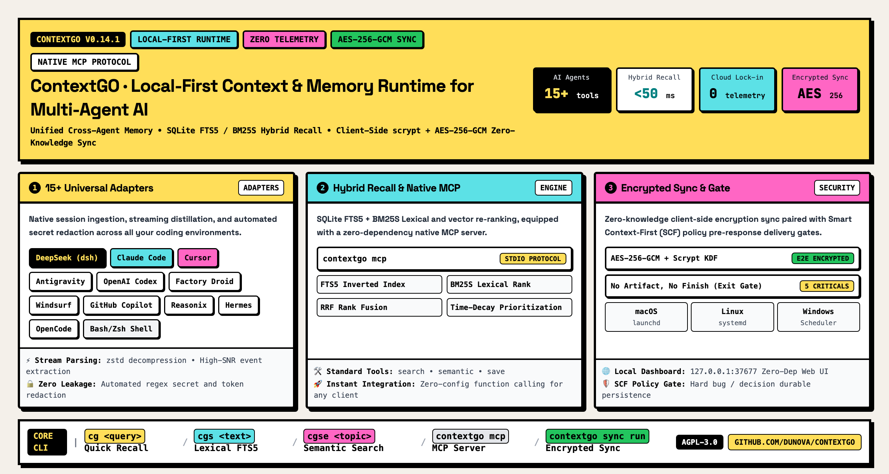

<p align="center">
  <picture>
    <source media="(prefers-color-scheme: dark)" srcset="docs/media/logo-dark.svg">
    
  </picture>
</p>

<p align="center">
  <strong>Local-First Context &amp; Memory Runtime for Multi-Agent AI Coding Teams</strong><br>
  <em>Unified cross-agent memory, sub-second hybrid retrieval, native Model Context Protocol (MCP), and zero-knowledge encrypted multi-machine sync.</em>
</p>

<p align="center">
  <a href="https://pypi.org/project/contextgo/"></a>
  <a href="https://pypi.org/project/contextgo/"></a>
  <a href="https://github.com/dunova/ContextGO/actions/workflows/verify.yml"></a>
  <a href="https://github.com/dunova/ContextGO/actions/workflows/codeql.yml"></a>
  <a href="https://codecov.io/gh/dunova/ContextGO"></a>
  <a href="https://modelcontextprotocol.io"></a>
  <a href="https://github.com/dunova/ContextGO/blob/main/LICENSE"></a>
</p>

<p align="center">
  <a href="https://github.com/dunova/ContextGO/stargazers">
    
  </a>
  <a href="https://github.com/dunova/ContextGO/subscription">
    
  </a>
</p>

<p align="center">
  <a href="https://github.com/dunova/ContextGO"></a>
  <a href="https://github.com/dunova/ContextGO/fork"></a>
  <a href="https://github.com/dunova/ContextGO/watchers"></a>
</p>

<p align="center">
  <a href="#overview--architecture">Architecture</a> •
  <a href="#why-contextgo">Why ContextGO?</a> •
  <a href="#quick-start">Quick Start</a> •
  <a href="#native-mcp-server-support-v0141">Native MCP</a> •
  <a href="#supported-ai-agents--ides">Supported Agents</a> •
  <a href="#hybrid-retrieval-engine">Hybrid Engine</a> •
  <a href="#cli-command-reference">CLI Reference</a> •
  <a href="#zero-knowledge-multi-device-sync">Encrypted Sync</a> •
  <a href="#smart-context-first-scf-policy">Smart Recall</a> •
  <a href="README.zh.md">简体中文</a>
</p>

---

## Overview & Architecture

Modern AI software development rarely relies on a single tool. In any non-trivial engineering workflow, engineers fluidly switch between multiple AI coding assistants: **DeepSeek Agent (`dsh`)** for autonomous agentic refactoring, **Claude Code** for terminal-based project reasoning, **Cursor** or **Windsurf** for inline code completions, and **Antigravity / Gemini** for orchestrated subagent tasks.

However, each AI assistant functions within a **siloed, ephemeral memory sandbox**. When a developer changes tools, reboots a terminal session, or switches between laptops:
- **Historical context evaporates**: Past code explorations, architecture discussions, and verified root causes disappear.
- **Agents repeat known failures**: The next assistant attempts the exact same dead-end fix that another tool already disproved an hour ago.
- **Friction and context switching compound**: Engineers waste substantial time manually copying logs, transcripts, and decisions across disparate tools.

**ContextGO solves this by providing a unified, local-first shared intelligence runtime for your AI coding assistants.** It runs silently on your machine, auto-discovers and indexes sessions from **15+ AI coding environments**, exposes a native **Model Context Protocol (MCP)** stdio server for live tool calling, and delivers **sub-second hybrid lexical/vector recall** with zero data exfiltration.

<p align="center">
  <a href="docs/media/contextgo-architecture-showcase-en.png">
    
  </a>
</p>
<p align="center"><em>ContextGO 4-Tier Architecture: Multi-Agent Adapters, Local SQLite Engine, Interfaces & Native MCP Server, and Encrypted Multi-Device Sync.</em></p>

---

## Why ContextGO?

| Capability | What ContextGO Delivers | Traditional Workflows |
|---|---|---|
| **Ecosystem Reach** | **15+ AI tools auto-indexed** (DeepSeek, Claude Code, Cursor, Windsurf, Copilot, Antigravity, OpenCode, etc.) | Isolated, vendor-locked proprietary logs |
| **Model Context Protocol** | **Native MCP Server (`contextgo mcp`)** with stdio JSON-RPC 2.0 tool calling | Ad-hoc terminal scripts or no tool integration |
| **Retrieval Speed & Precision** | **Sub-second hybrid recall** (SQLite FTS5 + BM25S + dense vector RRF + time-decay) | Slow file scanning or naive regex search |
| **Privacy & Security** | **100% Local-First**, zero telemetry, zero mandatory cloud dependencies | Remote cloud database lock-in, data privacy risks |
| **Multi-Device Mobility** | **AES-256-GCM encrypted sync** over private GitHub repository with conflict-free shards | Manual copy-pasting or unsynced machines |
| **Agent Discipline** | **Smart Context-First (SCF)** automated policy injection (`contextgo setup`) | Agents constantly hallucinate or ignore project history |
| **Operational Simplicity** | **Zero mandatory dependencies**, native OS background daemons, local Web UI | Heavy infrastructure setups (Docker, PostgreSQL, Vector DBs) |

---

## Quick Start

### 1. Installation

Install ContextGO globally using `pipx` to keep your Python environment clean and isolated:

```bash
# Standard installation with lexical hybrid recall & core engine
pipx install "contextgo[vector]"

# Or include zero-knowledge encrypted multi-machine sync
pipx install "contextgo[sync,vector]"
```

### 2. Shell Integration

Add instant shell aliases (`cg` for quick recall, `cgs` for full-text search, `cgse` for semantic recall):

```bash
eval "$(contextgo shell-init)"
```

Add that single line to your `~/.zshrc`, `~/.bashrc`, or configuration profile.

### 3. Verify Health & Auto-Detected Adapters

```bash
# Check runtime health, active databases, and vector status
contextgo health

# Inspect all detected AI coding tools and session counts on your machine
contextgo sources
```

### 4. Search & Recall Context Instantly

```bash
# Fast hybrid recall (automatically routes to keyword search or session ID lookup)
cg "how did we resolve the MT5 wine socket timeout?"

# Full-text lexical search across all indexed AI session histories
cgs "AdGuard Home DNS" --limit 5

# Memory-first semantic recall prioritizing durable architecture decisions
cgse "sync engine encryption and sharding architecture" --limit 3

# Save an authoritative technical conclusion or verified bug root cause
contextgo save --title "Bug: MT5 socket hang" --content "Resolved by tuning SO_RCVTIMEO to 15s." --tags "mt5,network"
```

---

## Native MCP Server Support (v0.14.1)

ContextGO v0.14.1 introduces official **Model Context Protocol (MCP)** support. By running `contextgo mcp`, ContextGO acts as a standard JSON-RPC 2.0 stdio server, exposing native Function Calling tools directly to DeepSeek Agent (`dsh`), Claude Code, Cursor, Windsurf, Zed, and any MCP-compliant environment.

### Exposed MCP Tools

| MCP Tool | Signature | Purpose |
|---|---|---|
| `contextgo_recall` | `query: string` | **Fast hybrid recall**: Queries cross-agent technical history, session context, and prior architectural decisions. Recommended for quick context lookups. |
| `contextgo_search` | `query: string, limit?: number` | **Full-text search**: Performs lexical BM25/FTS5 search over all indexed AI coding sessions and tool invocation logs. |
| `contextgo_semantic` | `topic: string, limit?: number` | **Semantic memory recall**: Prioritizes durable architectural decisions, confirmed root causes, and technical milestones. |
| `contextgo_save` | `title: string, content: string, tags?: string` | **Durable memory persistence**: Saves verified bug root causes, architectural decisions, and cross-session handoffs directly into the local memory store. |

### Configuration Examples

#### 1. Claude Desktop & Claude Code
Add to your `claude_desktop_config.json` or `~/.claude/mcp.json`:

```json
{
  "mcpServers": {
    "contextgo": {
      "command": "contextgo",
      "args": ["mcp"]
    }
  }
}
```

#### 2. Cursor IDE
Add to `.cursor/mcp.json` or Global Cursor Settings:

```json
{
  "mcpServers": {
    "contextgo": {
      "command": "contextgo",
      "args": ["mcp"]
    }
  }
}
```

#### 3. Windsurf
Add to `~/.codeium/windsurf/mcp_config.json`:

```json
{
  "mcpServers": {
    "contextgo": {
      "command": "contextgo",
      "args": ["mcp"]
    }
  }
}
```

#### 4. DeepSeek Agent (`dsh`)
Include in your `.dsh/config.json` or launch with stdio pipe:

```json
{
  "tools": [
    {
      "type": "mcp",
      "command": "contextgo",
      "args": ["mcp"]
    }
  ]
}
```

---

## Supported AI Agents & IDEs

ContextGO automatically discovers, streams, and harmonizes sessions from **15+ development tools** on your machine without requiring manual configuration or altering agent binaries:

| Category | AI Assistant / Platform | Ingestion & Discovery Mechanism |
|---|---|---|
| **Autonomous Coding Agents** | **DeepSeek Agent (`dsh`)** | Real-time streaming `.zstd` event decompression, `.dsh/storages/session_projcache.json` parsing |
| | **Claude Code** | Real-time tracking of `~/.claude/projects/` and `~/.claude/transcripts/` JSONL event streams |
| | **Reasonix Agent** | Native discovery of `.reasonix/projects/*/sessions`, `events.jsonl`, and high-SNR turn filtration |
| | **Hermes Agent** | Automated ingestion of `~/.hermes/sessions/*.jsonl` and sidecar metadata |
| | **Factory Droid** | Extraction of `~/.factory/sessions/*.jsonl` event journals |
| | **OpenClaw & Accio** | Indexing of `~/.openclaw/agents/` and `~/.accio/agents/` task sessions |
| **IDEs & Smart Editors** | **Cursor** | Decoding of globalStorage workspace state and internal vscdb SQLite stores |
| | **Windsurf** | Extraction of Codeium cascade histories and local workspace SQLite databases |
| | **GitHub Copilot** | Continuous ingestion of `~/.copilot/session-state/*/events.jsonl` conversation files |
| | **Antigravity (Gemini)** | Parsing of `~/.gemini/antigravity/brain/*/walkthrough.md` and interaction logs |
| | **Kilo, Cline & Roo Code** | Extraction of VS Code globalStorage task states, execution transcripts, and tool logs |
| | **OpenCode & Zed** | Integration with `opencode.db` and `.config/zed/conversations/` records |
| **Shell & Durable Memory** | **Terminal Shells** | Deduplicated indexing of `~/.zsh_history` and `~/.bash_history` commands |
| | **Durable Memory Store** | Structured persistence via `contextgo save`, JSON observations, and key technical milestones |

---

## Hybrid Retrieval Engine

ContextGO delivers sub-second search precision across hundreds of thousands of conversational turns through a multi-stage, privacy-first retrieval pipeline:

1. **SQLite FTS5 Lexical Indexing**: Tokenizes source events into a local inverted index with Porter stemming and BM25 ranking.
2. **Dense Vector Embeddings (Optional)**: Employs lightweight, CPU-efficient Model2Vec 256-dimensional embeddings for semantic affinity without needing GPU infrastructure.
3. **Reciprocal Rank Fusion (RRF)**: Merges lexical keyword hits and dense vector semantic candidates using mathematical RRF scoring ($RRF = \sum \frac{1}{k + r}$).
4. **Dynamic Time-Decay Prioritization**: Exponentially boosts recent, highly relevant decisions while preserving historical milestones.
5. **Noise Marker Filtering**: Automatically identifies and suppresses boilerplate system prompts, repetitive error stack traces, and low-SNR agent artifacts.

---

## CLI Command Reference

```bash
usage: contextgo [-h] [--version] <command> ...
```

| Command | Example Usage | Description |
|---|---|---|
| `q` | `contextgo q "query string"` | **Smart hybrid recall**: Auto-routes to BM25S/FTS or direct session ID lookup. |
| `search` | `contextgo search "keyword" --limit 10` | **Full-text search**: Fast lexical search across all indexed sessions and tool calls. |
| `semantic` | `contextgo semantic "topic" --limit 5` | **Semantic search**: Memory-first retrieval with automatic session history fallback. |
| `save` | `contextgo save --title "..." --content "..."` | **Save durable memory**: Persists architecture decisions, bug root causes, or handoffs. |
| `mcp` | `contextgo mcp` | **Native MCP server**: Runs the standard JSON-RPC 2.0 stdio server for MCP clients. |
| `sources` | `contextgo sources` | **Adapter inspector**: Lists all discovered AI tools, session counts, and file paths. |
| `health` | `contextgo health` | **Health check**: Outputs runtime status, database integrity, and index statistics. |
| `serve` | `contextgo serve --port 37677` | **Web UI**: Launches the built-in zero-dependency local memory browser. |
| `sync` | `contextgo sync {init,push,pull,status,run}` | **Encrypted sync**: Manages zero-knowledge cross-machine repository synchronization. |
| `setup` | `contextgo setup` | **One-click rule injection**: Injects Smart Context-First (SCF) rules into all AI tools. |
| `unsetup` | `contextgo unsetup` | **Teardown**: Safely removes injected ContextGO prompt rules from all agent configs. |
| `daemon` | `contextgo daemon {start,stop,status,install}` | **Daemon management**: Controls background capture and native OS service units. |
| `export` | `contextgo export "" backup.json` | **Sanitized export**: Exports memory observations with automatic credential redaction. |
| `import` | `contextgo import backup.json` | **Memory import**: Restores portable memory snapshots into the local memory store. |
| `smoke` | `contextgo smoke --sandbox` | **Quality gate**: Executes full end-to-end integration tests in an isolated sandbox. |

---

## Zero-Knowledge Multi-Device Sync

ContextGO provides secure, cross-machine synchronization backed by any private GitHub repository:

```bash
# 1. Initialize sync on your primary workstation (e.g. Windows 11)
contextgo sync init --repo your-org/my-contextgo-sync --device-id workstation-win11

# 2. Push encrypted shards to your private repository
contextgo sync push

# 3. Pull and merge on your laptop (e.g. macOS)
pipx install "contextgo[sync,vector]"
contextgo sync init --repo your-org/my-contextgo-sync --device-id macbook-m4
contextgo sync pull
```

### Security Guarantees

- **Client-Side AES-256-GCM**: Every session observation is compressed and encrypted on your local machine before upload. The remote repository only ever receives encrypted ciphertext.
- **Scrypt Key Derivation**: Encryption keys are derived locally using `scrypt` with a unique per-repository salt. Your passphrase is never transmitted or stored remotely.
- **Conflict-Free Device Shards**: Each machine commits exclusively to its own encrypted partition (`shards/<device-id>.enc.json`), eliminating Git merge conflicts across platforms.
- **Pre-Sync Credential Sanitization**: API keys, bearer tokens, private keys, and local home directory paths are automatically detected and redacted prior to encryption.

---

## Smart Context-First (SCF) Policy

AI agents perform significantly better when instructed to check prior project context before writing code. Running `contextgo setup` injects the canonical **Smart Context-First (SCF)** policy into active agent instruction files (`GEMINI.md`, `CLAUDE.md`, `.cursorrules`, `copilot-instructions.md`, etc.):

```bash
contextgo setup
```

### Proactive Recall Guidelines for AI Agents

| Trigger Event | Autonomous Agent Action |
|---|---|
| **Continuation task** (`接着做` / `continue`) | Run `contextgo semantic "<topic>" --limit 3` to align with past progress |
| **Uncertainty about prior design** | Run `contextgo search "<keyword>" --limit 5` before making assumptions |
| **Prior to major architectural refactoring** | Query past decisions and postmortems to avoid repeating proven antipatterns |
| **Bug root cause identified / Decision finalized** | Run `contextgo save --title "..." --content "..."` to crystallize the memory |

---

## Native Background Daemon & Web Viewer

Run ContextGO as a native, lightweight background service for automatic, non-invasive session indexing:

```bash
# Control the background service
contextgo daemon start
contextgo daemon status
contextgo daemon stop

# Install the native OS service unit
contextgo daemon install
```

| Operating System | Native Backend | Service Location |
|---|---|---|
| **macOS** | Native user `launchd` service | `~/Library/LaunchAgents/io.dunova.contextgo.plist` |
| **Linux** | Native `systemd` user unit | `~/.config/systemd/user/contextgo.service` |
| **Windows** | Native Windows Task Scheduler user task | `ContextGO_Daemon` |

### Zero-Dependency Local Web Viewer

Launch the built-in dashboard to visually explore sessions, search memories, and inspect agent timelines:

```bash
contextgo serve --port 37677
```
Open [http://127.0.0.1:37677](http://127.0.0.1:37677) in your browser. The viewer runs entirely locally with zero external network requests.

---

## Security & Privacy Commitment

- **100% Local Execution**: ContextGO stores all databases, indexes, and logs locally under `~/.contextgo`.
- **Zero Silent Telemetry**: No analytics, telemetry pings, tracking tokens, or user data are ever sent over the network.
- **Zero Mandatory Third-Party Dependencies**: The core CLI, SQLite engine, MCP server, and Web viewer rely solely on the Python standard library.
- **Safe for Proprietary & Air-Gapped Codebases**: Completely safe to use in enterprise, financial, and confidential software environments.

---

## Development & Release Gates

ContextGO enforces rigorous release quality standards with **86%+ test coverage** and full lint/security validation:

```bash
# Clone repository
git clone https://github.com/dunova/ContextGO.git
cd ContextGO

# Sync development dependencies using uv
uv sync --extra dev --extra sync --extra vector

# Run code style, type check, and security audits
uv run ruff check src/contextgo tests
uv run ruff format --check src/contextgo tests
uv run mypy src/contextgo --ignore-missing-imports
uv run bandit -r src/contextgo -c pyproject.toml --quiet

# Execute full test suite & sandbox smoke gate
uv run pytest
uv run contextgo smoke --sandbox
```

---

## Community & Star Support

If ContextGO saves you time and keeps your AI coding agents in sync, please consider starring the repository! Every star helps support open, local-first developer tooling.

<p align="center">
  <a href="https://github.com/dunova/ContextGO">
    
  </a>
  &nbsp;&nbsp;
  <a href="https://github.com/dunova/ContextGO/subscription">
    
  </a>
</p>

- 🐛 **Found a bug or need a new adapter?** Open an issue on the [GitHub Issue Tracker](https://github.com/dunova/ContextGO/issues).
- 💡 **Have a feature idea or discussion?** Join the [GitHub Discussions](https://github.com/dunova/ContextGO/discussions).
- 🤝 **Want to contribute?** Read our [Contributing Guide](.github/CONTRIBUTING.md).

---

## License

ContextGO is licensed under the [AGPL-3.0-only](LICENSE) license.

Copyright © 2025-2026 [Dunova](https://github.com/dunova).
