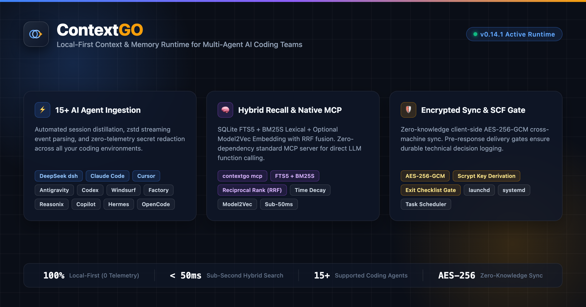

<p align="center">
  <picture>
    <source media="(prefers-color-scheme: dark)" srcset="docs/media/logo-dark.svg">
    
  </picture>
</p>

<p align="center">
  <strong>面向多 Agent 协同的本地优先 AI 编码上下文与持久记忆运行时</strong><br>
  <em>跨 15+ 款智能体跨工具会话融合、原生 MCP 协议支持、FTS5+BM25S 亚秒级混合检索与端到端加密跨设备同步。</em>
</p>

<p align="center">
  <a href="https://pypi.org/project/contextgo/"></a>
  <a href="https://pypi.org/project/contextgo/"></a>
  <a href="https://github.com/dunova/ContextGO/actions/workflows/verify.yml"></a>
  <a href="https://github.com/dunova/ContextGO/actions/workflows/codeql.yml"></a>
  <a href="https://codecov.io/gh/dunova/ContextGO"></a>
  <a href="https://modelcontextprotocol.io"></a>
  <a href="https://github.com/dunova/ContextGO/blob/main/LICENSE"></a>
</p>

<p align="center">
  <a href="https://github.com/dunova/ContextGO/stargazers">
    
  </a>
  <a href="https://github.com/dunova/ContextGO/subscription">
    
  </a>
</p>

<p align="center">
  <a href="https://github.com/dunova/ContextGO"></a>
  <a href="https://github.com/dunova/ContextGO/fork"></a>
  <a href="https://github.com/dunova/ContextGO/watchers"></a>
</p>

<p align="center">
  <a href="#核心概览与全景架构">全景架构</a> •
  <a href="#为什么选择-contextgo">核心优势</a> •
  <a href="#快速上手">快速上手</a> •
  <a href="#原生-mcp-协议服务-v0141">原生 MCP</a> •
  <a href="#支持的-ai-agent--ide-矩阵">支持的 Agent</a> •
  <a href="#混合检索内核架构">检索内核</a> •
  <a href="#cli-核心命令参考">命令参考</a> •
  <a href="#零知识跨机器加密同步">加密同步</a> •
  <a href="#ai-agent-智能上下文预热-scf">智能预热</a> •
  <a href="README.md">English</a>
</p>

---

## 核心概览与全景架构

现代 AI 辅助研发通常涉及多工具协同：开发者习惯使用 **DeepSeek Agent (`dsh`)** 进行自主代码重构，使用 **Claude Code** 进行全项目深度语义推理，使用 **Cursor** 或 **Windsurf** 享受流畅的行内补全，并借助 **Antigravity / Gemini** 执行复杂任务编排。

然而，各大 AI 编码工具目前各自为政，处于严重的**记忆孤岛与上下文割裂**状态。当开发者切换工具、重启终端或在多台电脑间工作时：
- **历史上下文瞬间归零**：过往的技术探索、架构推演和根因分析无法跨工具继承。
- **Agent 重复踩坑犯错**：新的智能体会盲目尝试刚刚被另一个工具验证失败的方案。
- **上下文搬运成本极高**：工程师不得不耗费大量时间在各工具间手动复制粘贴 Prompt、日志与错误堆栈。

**ContextGO 专为解决这一行业痛点而生，为现代多 Agent 协同工作流构建本地优先的共享智慧运行时。** 它在后台静默运行，自动发现并聚合来自 **15+ 款主流 AI 编程工具** 的执行会话与决策，原生暴露标准 **Model Context Protocol (MCP)** stdio 服务，并提供亚秒级词法/向量混合召回，且绝不上传任何隐私数据。

<p align="center">
  <a href="docs/media/contextgo-architecture-showcase.png">
    
  </a>
</p>
<p align="center"><em>ContextGO 四层架构全景：多源智能体适配层、本地高性能 SQLite 引擎、服务接口与原生 MCP 服务，以及跨设备端到端加密同步。</em></p>

---

## 为什么选择 ContextGO？

| 维度 | ContextGO 解决方案 | 传统开发困局 |
|---|---|---|
| **生态覆盖** | **15+ 款主流 AI 工具自动识别**（DeepSeek、Claude Code、Cursor、Windsurf、Copilot、Antigravity、OpenCode 等） | 各工具日志格式封闭互不兼容 |
| **标准协议** | **原生 MCP 服务（`contextgo mcp`）**，标准 JSON-RPC 2.0 stdio 接口，智能体无缝 Function Calling | 缺乏标准协议，需手工查阅或写临时脚本 |
| **召回性能** | **亚秒级混合召回**（SQLite FTS5 + BM25S 词法 + 稠密向量 RRF 融合 + 动态时效衰减） | 原始文件全局扫描缓慢且缺乏相关性排序 |
| **隐私安全** | **100% 本地优先**，零遥测、零外部中心化依赖、零数据出境风险 | 商业云端记忆服务存在代码与隐私泄露隐患 |
| **多端流转** | **AES-256-GCM 端到端加密同步**，基于 GitHub 私有仓库，独立分片杜绝合并冲突 | 换电脑或重装系统导致过往记忆全部丢失 |
| **行为规范** | **智能上下文预热（SCF）**一键注入（`contextgo setup`），倒逼智能体主动读取历史 | 智能体缺乏项目记忆，高频产生代码幻觉 |
| **工程极简** | **核心运行时零强制外部依赖**，内置原生系统守护进程，提供轻量级 Web 可视化面板 | 依赖 Docker、Postgres 或重型向量数据库，部署沉重 |

---

## 快速上手

### 1. 安装

推荐使用 `pipx` 安装，使 ContextGO 运行在隔离的 Python 运行环境中：

```bash
# 标准安装（包含核心引擎与词法混合检索）
pipx install "contextgo[vector]"

# 或同时包含零知识跨设备加密同步功能
pipx install "contextgo[sync,vector]"
```

### 2. 终端集成

一键启用高效终端别名（`cg` 快速智能召回、`cgs` 全文精准搜索、`cgse` 语义长效记忆检索）：

```bash
eval "$(contextgo shell-init)"
```

将该行追加至您的 `~/.zshrc`、`~/.bashrc` 或对应 Shell 配置文件中即可永久生效。

### 3. 健康检查与智能体适配探测

```bash
# 检查运行时健康状态、数据库完整性与向量状态
contextgo health

# 查看本地已自动发现的 AI 编程工具与会话数量
contextgo sources
```

### 4. 即刻检索与调阅历史上下文

```bash
# 快速混合召回（自动路由短语关键词或精准匹配 Session ID）
cg "之前是怎么修复 MT5 Wine Socket 阻塞超时的？"

# 在所有智能体会话日志中执行精准全文检索
cgs "AdGuard Home DNS" --limit 5

# 优先调阅长效技术决策库的语义召回
cgse "关于同步引擎加密与分片机制的架构决策" --limit 3

# 将经过实盘验证的技术结论或 Bug 根因沉淀为持久记忆
contextgo save --title "Bug: MT5 socket 挂死" --content "将 SO_RCVTIMEO 调整至 15s 成功解决。" --tags "mt5,network"
```

---

## 原生 MCP 协议服务 (v0.14.1)

ContextGO v0.14.1 全面支持官方 **Model Context Protocol (MCP)**。通过执行 `contextgo mcp` 命令，ContextGO 即可作为标准 JSON-RPC 2.0 stdio 服务启动，向 DeepSeek Agent (`dsh`)、Claude Code、Cursor、Windsurf、Zed 及任何兼容 MCP 的客户端提供原生工具调用能力。

### 暴露的 MCP 原生工具

| MCP 工具名称 | 参数签名 | 功能说明 |
|---|---|---|
| `contextgo_recall` | `query: string` | **快速混合召回**：跨智能体检索技术历史、会话上下文与历史决策，适合轻量级快速查询。 |
| `contextgo_search` | `query: string, limit?: number` | **全文词法检索**：在所有已索引的 AI 编程会话及工具调用日志中进行精准 BM25/FTS5 检索。 |
| `contextgo_semantic` | `topic: string, limit?: number` | **语义记忆检索**：优先检索经过人工落盘的持久化架构决策、已确认的 Bug 根因与里程碑结论。 |
| `contextgo_save` | `title: string, content: string, tags?: string` | **持久记忆沉淀**：将经过验证的技术结论、架构方案或交接文档持久化写入本地记忆库。 |

### 常见客户端配置示例

#### 1. Claude Desktop 与 Claude Code
在 `claude_desktop_config.json` 或 `~/.claude/mcp.json` 中配置：

```json
{
  "mcpServers": {
    "contextgo": {
      "command": "contextgo",
      "args": ["mcp"]
    }
  }
}
```

#### 2. Cursor IDE
在 `.cursor/mcp.json` 或全局设置中添加：

```json
{
  "mcpServers": {
    "contextgo": {
      "command": "contextgo",
      "args": ["mcp"]
    }
  }
}
```

#### 3. Windsurf
在 `~/.codeium/windsurf/mcp_config.json` 中添加：

```json
{
  "mcpServers": {
    "contextgo": {
      "command": "contextgo",
      "args": ["mcp"]
    }
  }
}
```

#### 4. DeepSeek Agent (`dsh`)
在 `.dsh/config.json` 中注入或通过管道启动：

```json
{
  "tools": [
    {
      "type": "mcp",
      "command": "contextgo",
      "args": ["mcp"]
    }
  ]
}
```

---

## 支持的 AI Agent 与 IDE 矩阵

ContextGO 原生兼容并自动索引当前开发机上的 **15+ 款工具**，无需修改智能体源码，亦无需繁琐配置：

| 平台类别 | 支持的工具与平台 | 自动探测与解析机制 |
|---|---|---|
| **自主编码智能体** | **DeepSeek Agent (`dsh`)** | 原生流式 `.zstd` 压缩事件解压，解析 `.dsh/storages/session_projcache.json` |
| | **Claude Code** | 实时监听 `~/.claude/projects/` 与 `~/.claude/transcripts/` 的 JSONL 会话流 |
| | **Reasonix Agent** | 自动发现 `.reasonix/projects/*/sessions`、`events.jsonl` 并进行高信噪比提纯 |
| | **Hermes Agent** | 解析 `~/.hermes/sessions/*.jsonl` 及附属元数据 |
| | **Factory Droid** | 扫描并提取 `~/.factory/sessions/*.jsonl` 事件日志 |
| | **OpenClaw 与 Accio** | 索引 `~/.openclaw/agents/` 与 `~/.accio/agents/` 任务记录 |
| **IDE 与智能插件** | **Cursor** | 解码 VS Code globalStorage 工作区状态及底层 vscdb SQLite 数据库 |
| | **Windsurf** | 提取 Codeium cascade 历史及本地 SQLite 工作区缓存 |
| | **GitHub Copilot** | 持续解析 `~/.copilot/session-state/*/events.jsonl` 对话历史 |
| | **Antigravity (Gemini)** | 索引 `~/.gemini/antigravity/brain/*/walkthrough.md` 及完整交互会话 |
| | **Kilo, Cline 与 Roo** | 解析 VS Code 全局存储的任务状态、执行日志与交互记录 |
| | **OpenCode 与 Zed** | 解析本地 `opencode.db` 与 `.config/zed/conversations/` 数据 |
| **终端与手工记忆** | **终端 Shell 历史** | 自动去重读取 `~/.zsh_history` 与 `~/.bash_history` 命令流水 |
| | **持久化长效记忆库** | 通过 `contextgo save` 录入的技术文档、JSON 观测快照与决策记录 |

---

## 混合检索内核架构

ContextGO 能够支撑数十万轮历史交互的亚秒级精准检索，依托于多阶段流水线：

1. **SQLite FTS5 全文倒排索引**：在本地建立高效倒排索引，支持词干提取与原生 BM25 评分排序。
2. **轻量级稠密向量检索（可选）**：采用 CPU 友好的 Model2Vec 256 维嵌入模型，无需昂贵 GPU 即可实现语义关联检索。
3. **倒数排序融合（RRF）**：结合精确词法命中与语义向量相似度候选，运用数学 RRF 算法（$RRF = \sum \frac{1}{k + r}$）实现最优结果排序。
4. **动态时效衰减加权**：近期高价值决策获得时效加权，同时保护重大历史里程碑不被遗漏。
5. **噪音标记清洗过滤**：自动识别并剔除系统模板提示词、冗长重复的错误堆栈与低信息量碎屑。

---

## CLI 核心命令参考

```bash
usage: contextgo [-h] [--version] <command> ...
```

| 子命令 | 典型调用示例 | 说明 |
|---|---|---|
| `q` | `contextgo q "查询词"` | **快速智能召回**：自动路由 BM25S/FTS 检索或会话 ID 快速提取。 |
| `search` | `contextgo search "关键词" --limit 10` | **全文搜索**：在已索引的会话日志与工具调用中执行检索。 |
| `semantic` | `contextgo semantic "主题" --limit 5` | **语义检索**：优先检索持久记忆库，未命中时回退到会话历史。 |
| `save` | `contextgo save --title "..." --content "..."` | **保存持久记忆**：将关键技术结论、根因或架构决策沉淀到本地存储。 |
| `mcp` | `contextgo mcp` | **原生 MCP 服务**：启动符合官方标准的 JSON-RPC 2.0 stdio 服务。 |
| `sources` | `contextgo sources` | **适配器探测**：列出已识别的 AI 平台、会话文件数与适配路径。 |
| `health` | `contextgo health` | **健康检查**：以 JSON 格式输出数据库完整性与运行时状态。 |
| `serve` | `contextgo serve --port 37677` | **可视化面板**：在本地启动零依赖的 Memory Viewer Web UI。 |
| `sync` | `contextgo sync {init,push,pull,status,run}` | **加密同步**：管理基于 GitHub 私有仓库的多机器端到端加密同步。 |
| `setup` | `contextgo setup` | **一键规则注入**：为所有已安装的 AI 工具注入智能预热（SCF）规则。 |
| `unsetup` | `contextgo unsetup` | **卸载规则**：安全移除 ContextGO 注入的所有提示词规则。 |
| `daemon` | `contextgo daemon {start,stop,status,install}` | **守护服务管理**：控制后台自动索引与系统级自启服务。 |
| `export` | `contextgo export "" backup.json` | **安全导出**：自动脱敏 API Key 与敏感路径后导出记忆快照。 |
| `import` | `contextgo import backup.json` | **记忆导入**：将便携记忆快照导入到本地记忆库中。 |
| `smoke` | `contextgo smoke --sandbox` | **质量门禁**：在隔离沙箱环境中执行全链路冒烟测试。 |

---

## 零知识跨机器加密同步

ContextGO 支持借助用户的任意私有 GitHub 仓库实现安全、零知识的多机器同步：

```bash
# 1. 在主开发机上初始化同步（例如 Windows 11）
contextgo sync init --repo your-org/my-contextgo-sync --device-id workstation-win11

# 2. 推送本地加密分片
contextgo sync push

# 3. 在另一台笔记本上拉取并合并（例如 macOS）
pipx install "contextgo[sync,vector]"
contextgo sync init --repo your-org/my-contextgo-sync --device-id macbook-m4
contextgo sync pull
```

### 安全与隐私保障

- **客户端 AES-256-GCM**：所有会话与记忆数据均在本地压缩后加密，远端 GitHub 仓库仅存储高强度密文。
- **本地 scrypt 口令派生**：加密密钥仅由用户输入的口令与仓库独立 Salt 在本地派生，口令绝不触网。
- **独立设备分片（Shards）**：每台设备独立维护专属分片文件（`shards/<device-id>.enc.json`），从根本上避免 Git 跨平台合并冲突。
- **敏感信息前置脱敏**：在加密上传前，自动识别并过滤 API Key、Token 凭证与开发机本地绝对路径。

---

## AI Agent 智能上下文预热 (SCF)

当 AI 助手在编码前先调阅项目历史时，回答准确率将大幅提升。执行 `contextgo setup` 即可自动向各智能体的全局规则文件中注入标准 **Smart Context-First (SCF)** 协议（覆盖 `GEMINI.md`、`CLAUDE.md`、`.cursorrules`、`copilot-instructions.md` 等）：

```bash
contextgo setup
```

### 智能体主动召回准则

| 场景 | 智能体规范动作 |
|---|---|
| **续做任务 / 状态恢复** (`接着做` / `continue`) | 执行 `contextgo semantic "<主题>" --limit 3` 快速对齐历史进度 |
| **不确定过往架构方案或技术选型** | 执行 `contextgo search "<关键词>" --limit 5` 查阅先验结论 |
| **重大代码重构或底层改动前** | 先检索过往故障复盘与设计原则，避免重复踩坑 |
| **确认 Bug 根因或确立关键架构** | 调用 `contextgo save --title "..." --content "..."` 固化记忆 |

---

## 原生后台守护进程与可视化面板

支持将 ContextGO 作为操作系统原生服务静默运行，实现无感知的后台增量索引：

```bash
# 启停与状态管理
contextgo daemon start
contextgo daemon status
contextgo daemon stop

# 安装系统原生自启服务
contextgo daemon install
```

| 操作系统 | 原生服务实现 | 服务配置文件位置 |
|---|---|---|
| **macOS** | 原生用户级 `launchd` 服务 | `~/Library/LaunchAgents/io.dunova.contextgo.plist` |
| **Linux** | 原生 `systemd` 用户级服务 | `~/.config/systemd/user/contextgo.service` |
| **Windows** | 原生 Windows 任务计划程序用户任务 | `ContextGO_Daemon` |

### 零依赖本地 Web 可视化面板

启动内置仪表盘，在浏览器中直观浏览全量历史会话、搜索技术记忆并追踪智能体时间线：

```bash
contextgo serve --port 37677
```
在浏览器中访问 [http://127.0.0.1:37677](http://127.0.0.1:37677)。面板完全在本地回环地址运行，零外网依赖。

---

## 隐私与安全承诺

- **100% 本地优先**：ContextGO 所有数据库、索引与临时文件均持久化在本地 `~/.contextgo` 目录中。
- **严禁静默遥测**：绝不收集任何用户行为数据，无任何分析打点代码，核心运行时零网络通信。
- **核心功能零第三方依赖**：核心 CLI、SQLite 引擎、MCP 服务与 Web 面板仅基于 Python 标准库构建。
- **企业与高密代码库安全**：完全满足金融级量化、保密研发与离线气隙（Air-Gapped）内网环境的安全要求。

---

## 开发者与工程质量门禁

ContextGO 遵循严苛的工程交付规范，核心单测覆盖率稳定保持在 **86% 以上**：

```bash
# 克隆代码仓库
git clone https://github.com/dunova/ContextGO.git
cd ContextGO

# 使用 uv 一键同步所有依赖
uv sync --extra dev --extra sync --extra vector

# 运行代码规范、类型检查与安全审计
uv run ruff check src/contextgo tests
uv run ruff format --check src/contextgo tests
uv run mypy src/contextgo --ignore-missing-imports
uv run bandit -r src/contextgo -c pyproject.toml --quiet

# 运行全量单元测试与沙箱冒烟门禁
uv run pytest
uv run contextgo smoke --sandbox
```

---

## 社区支持与 Star 助力

如果 ContextGO 帮助您理顺了多智能体开发工作流，欢迎在 GitHub 上为本项目点亮一颗 Star ⭐！您的支持是本地优先开源工具持续进化的最大动力。

<p align="center">
  <a href="https://github.com/dunova/ContextGO">
    
  </a>
  &nbsp;&nbsp;
  <a href="https://github.com/dunova/ContextGO/subscription">
    
  </a>
</p>

- 🐛 **提交 Bug 或申请新 Agent 适配器**：欢迎提交 [GitHub Issues](https://github.com/dunova/ContextGO/issues)。
- 💡 **技术交流与架构探讨**：欢迎加入 [GitHub Discussions](https://github.com/dunova/ContextGO/discussions)。
- 🤝 **参与代码贡献**：请参阅我们的 [贡献指南](.github/CONTRIBUTING.md)。

---

## 开源许可证

ContextGO 采用 [AGPL-3.0-only](LICENSE) 协议开源。

版权所有 © 2025-2026 [Dunova](https://github.com/dunova)。
