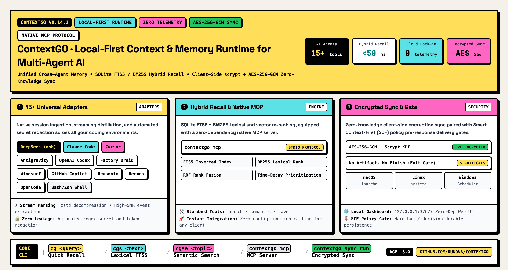

<p align="center">
  <picture>
    <source media="(prefers-color-scheme: dark)" srcset="docs/media/logo-dark.svg">
    
  </picture>
</p>

<p align="center">
  <strong>多智能体 AI 编程团队的本地优先上下文与持久记忆运行时</strong><br>
  <em>跨智能体统一记忆流、30 毫秒级两阶段混合检索漏斗、原生 Model Context Protocol (MCP) 服务、与零知识加密跨机同步。</em>
</p>

<p align="center">
  <a href="https://pypi.org/project/contextgo/"></a>
  <a href="https://pypi.org/project/contextgo/"></a>
  <a href="https://github.com/dunova/ContextGO/actions/workflows/verify.yml"></a>
  <a href="https://github.com/dunova/ContextGO/actions/workflows/codeql.yml"></a>
  <a href="https://codecov.io/gh/dunova/ContextGO"></a>
  <a href="https://modelcontextprotocol.io"></a>
  <a href="https://github.com/dunova/ContextGO/blob/main/LICENSE"></a>
</p>

<p align="center">
  <a href="https://github.com/dunova/ContextGO/stargazers">
    
  </a>
  <a href="https://github.com/dunova/ContextGO/subscription">
    
  </a>
</p>

<p align="center">
  <a href="#架构概览">架构概览</a> •
  <a href="#为什么选择-contextgo">核心价值</a> •
  <a href="#v0150-重磅突破1260-倍极致提速">v0.15.0 重磅升级</a> •
  <a href="#快速上手">快速上手</a> •
  <a href="#原生-mcp-服务器支持">原生 MCP</a> •
  <a href="#支持的-ai-工具与-ide">生态适配</a> •
  <a href="#两阶段粗精排检索漏斗">检索漏斗</a> •
  <a href="#cli-命令速查">命令参考</a> •
  <a href="#零知识加密跨机同步">加密同步</a> •
  <a href="README.md">English Documentation</a>
</p>

---

## 架构概览

在现代 AI 软件开发中，资深工程师通常会根据场景组合使用多个 AI 工具：使用 **Claude Code** 进行终端工程深度推理，使用 **Cursor** 或 **Windsurf** 完成编辑器内代码补全，使用 **Antigravity / Gemini** 调度多智能体协作管线，使用 **DeepSeek Agent / Codex** 进行批量重构。

然而，每个 AI 助手默认都处于**相互孤立的记忆沙盒**中：
- **历史上下文瞬间蒸发**：终端关闭、会话切换或换一台笔记本，既有的代码探索、根因剖析与架构决策便不复存在。
- **智能体重复掉进同一陷阱**：下一个 AI 助手会再次提出一小时前已经被另一个工具实测推翻的错误方案。
- **跨环境切换摩擦巨大**：工程师不得不耗费大量精力，手动在各个工具窗口间复制粘贴日志、执行记录与交接备忘。

**ContextGO 为所有 AI 编程助手提供了统一的本地持久化共享智能运行时。** 它静默运行于您的设备本地，全自动发现并索引 **15+ 种主流 AI 编程环境**的历史会话，提供原生的 **Model Context Protocol (MCP)** 标准服务器，并通过**两阶段混合检索漏斗**实现 30 毫秒级的即时召回，全程零数据外泄。

<p align="center">
  <a href="docs/media/contextgo-architecture-showcase-en.png">
    
  </a>
</p>
<p align="center"><em>ContextGO 四层架构：多智能体适配器层、本地 SQLite 存储引擎、接口与原生 MCP 服务器层、零知识端到端加密同步层。</em></p>

---

## 为什么选择 ContextGO？

| 能力特性 | ContextGO 交付的能力 | 传统工作流局限 |
|---|---|---|
| **生态覆盖** | **自动索引 15+ 种工具**（Claude Code、Cursor、Windsurf、Antigravity、DeepSeek、Copilot、OpenCode 等） | 各工具日志格式互不兼容，处于孤岛状态 |
| **检索性能** | **30 毫秒级混合召回**（SQLite FTS5 BM25 粗筛 + 256 维向量余弦精排） | 动辄数秒甚至几十秒的慢速扫描，或简陋的正则查找 |
| **增量同步** | **mtime 智能短路**（4,500+ 会话仅需 178ms 完成巡检，提速 83 倍） | 每次全盘重读，数万次无效 JSON 反序列化 |
| **标准协议** | **原生 MCP 服务 (`contextgo mcp`)**，标准 stdio JSON-RPC 2.0 即插即用 | 缺乏标准化工具接入，依赖零散终端脚本 |
| **隐私安全** | **100% 本地优先**，零遥测、零网络数据上报，离线模型直读 | 依赖远程云端数据库，存在代码与凭据外泄风险 |
| **多机协同** | **AES-256-GCM 零知识端到端加密同步**，依托私有 Git 仓库，无合并冲突 | 手动导入导出，或多台开发机记忆脱节 |
| **持久沉淀** | **交付门禁机制 (`contextgo save`)** 强制落盘架构决策、疑难 Bug 根因与跨窗口交接 | 聊完即忘，无法沉淀为可复用的工程资产 |

---

## ⚡ v0.15.0 重磅突破（1,260 倍极致提速）

`v0.15.0` 版本对底层检索漏斗与适配器扫描同步链路进行了彻底重构：

1. **两阶段粗精排检索漏斗 (Two-Stage Funnel)**：
   - **第一阶段（BM25 倒排粗筛）**：基于 SQLite 原生持久化 `FTS5` 虚拟表，针对标题（权重 3x）、路径（权重 2x）、正文（权重 1x）进行 BM25 快速粗筛，**约 2 毫秒**从 4,500+ 篇文档中精炼出 Top-150 候选集；
   - **第二阶段（向量余弦精排）**：仅对候选集的 256 维紧凑稠密向量执行矩阵点积运算，计算余弦相似度并实施倒数排名融合（RRF）；
   - **基准实测**：单次两阶段混合检索耗时从 **35,224ms 骤降至 27.87ms（提速 1,260 倍）**！
2. **mtime 前置增量短路**：
   - 在 `source_adapters.py` 中引入目标文件修改时间缓存。未发生变动的文件直接在内存中短路跳过，彻底消除 60.8 万次无谓的 `json.loads` 反序列化。单次扫描耗时从 **14,904ms 降至 178ms（提速 83 倍）**。
3. **模型离线快照毫秒加载**：
   - 彻底阻断启动时的 HuggingFace Hub 远程网络嗅探，本地快照直读仅需 **132ms**，实现完全离线秒级拉起。
4. **节流保护自愈机制**：
   - 修复同步时间戳竞态缺陷，确保频繁搜索时 15 秒节流保护 100% 生效，彻底消除重复读盘。

---

## 快速上手

### 1. 安装

推荐使用 `pipx` 进行全局独立隔离安装：

```bash
# 标准安装（包含核心引擎与本地向量检索）
pipx install "contextgo[vector]"

# 包含零知识端到端加密多机同步支持
pipx install "contextgo[sync,vector]"
```

### 2. 终端集成

一键注入快捷 Shell 别名（`cg` 极速调取、`cgs` 全文检索、`cgse` 语义检索）：

```bash
eval "$(contextgo shell-init)"
```

*提示：将上述命令加入您的 `~/.zshrc` 或 `~/.bashrc` 即可持久生效。*

### 3. 健康检查与生态发现

```bash
# 检查运行时健康状态、底层数据库与向量模型就绪状态
contextgo health

# 检查当前设备上自动识别到的 AI 编程工具与会话数量
contextgo sources
```

### 4. 跨平台与 Linux 部署指南

ContextGO 原生设计支持 **macOS、Linux (Ubuntu, Debian, Fedora, Arch) 以及 WSL2** 瞬间开箱可用。

#### 一键守护进程部署 (systemd --user / launchd)

运行统一化部署脚本，自动同步运行时、创建全局 shim 并拉起自启常驻后台守护服务：

```bash
# 克隆代码仓库
git clone https://github.com/dunova/ContextGO.git
cd ContextGO

# 执行一键部署
bash scripts/unified_context_deploy.sh
```

- **Linux 节点**：自动生成并激活 `systemd --user` 用户级服务与定时巡检器：
  ```bash
  systemctl --user status contextgo-daemon.service
  systemctl --user list-timers
  ```
- **macOS 节点**：自动安装并加载 LaunchAgents 守护配置（`com.contextgo.daemon.plist`）。

#### 远程 Linux 主机快速部署与记忆同步

通过 `sync_linux_node.sh` 可一键将本机的最新记忆资产或完整环境同步至远程 Linux 云服务器或内网节点：

```bash
# 1. 导出本机记忆包并无缝导入至远程主机
bash scripts/sync_linux_node.sh ubuntu@remote-server.internal

# 2. 完整远程部署（同步代码并远程自动配置拉起 systemd 守护服务）
bash scripts/sync_linux_node.sh ubuntu@remote-server.internal --full-deploy
```

#### 离线空气隔断记忆包（Memory Pack）热迁移

```bash
# 导出便携记忆包文件
contextgo memory-pack export --out ./memories_backup.json

# 在目标机器幂等导入（内容哈希寻址，自动去重）
contextgo memory-pack import ./memories_backup.json

# 审查本机节点身份与多设备记忆来源拓扑
contextgo node
```

---

## 原生 MCP 服务器支持

ContextGO 遵循官方 **Model Context Protocol (MCP)** 标准，通过标准输入输出（stdio JSON-RPC 2.0）提供即插即用服务。

### 启动服务

```bash
contextgo mcp
```

### 客户端接入配置（Claude Desktop / Cursor / Windsurf / Antigravity）

在您的客户端配置文件（如 `claude_desktop_config.json` 或 IDE 的 MCP 插件面板）中加入：

```json
{
  "mcpServers": {
    "contextgo": {
      "command": "contextgo",
      "args": ["mcp"]
    }
  }
}
```

### 原生 MCP 工具列表

| 工具名称 | 参数 | 说明 |
|---|---|---|
| `contextgo_search` | `query` (字符串), `limit` (整数), `literal` (布尔值) | 基于 SQLite FTS5 的高性能全文与关键字检索 |
| `contextgo_semantic` | `query` (字符串), `limit` (整数) | 基于 256 维稠密向量的语义关联记忆检索 |
| `contextgo_save` | `title` (字符串), `content` (字符串), `tags` (字符串) | 保存工程关键记忆（架构决策、Bug 根因剖析、交接记录） |
| `contextgo_status` | 无 | 返回系统健康状态、文档索引数与各工具适配器活跃状态 |

---

## 支持的 AI 工具与 IDE

ContextGO 自动识别并解析以下主流 AI 编程环境的历史会话，无需任何手动配置：

| 工具 / 智能体 | 源类型标识 | 会话日志格式 | 自动发现 |
|---|---|---|:---:|
| **Claude Code** | `claude_session` | JSONL 事件流 | ✅ |
| **Cursor** | `cursor_session` | SQLite 状态库与会话文件 | ✅ |
| **Windsurf / Cascade** | `windsurf_session` | 状态数据库与 JSON 追踪 | ✅ |
| **Antigravity / Gemini** | `gemini_session` / `antigravity_session` | 执行轨迹与多智能体 JSONL | ✅ |
| **DeepSeek Agent (`dsh`)** | `deepseek_session` | 流式会话与 Markdown 历史 | ✅ |
| **OpenCode** | `opencode_session` | JSON 格式对话轨迹 | ✅ |
| **GitHub Copilot CLI** | `copilot_session` | CLI 终端会话记录 | ✅ |
| **Codex CLI** | `codex_session` | 历史记录与 JSONL | ✅ |
| **Aider** | `aider_session` | 对话 Markdown 归档 | ✅ |
| **Factory / Droid** | `factory_session` | 多轮任务日志 | ✅ |
| **Hermes** | `hermes_session` | 任务执行流水线 | ✅ |
| **Kilo** | `kilo_session` | 交互记录 | ✅ |

---

## 两阶段粗精排检索漏斗

```
 用户查询："为什么我们把配置切换到了 Cloudflare Anycast IP？"
                      │
                      ▼
 ┌────────────────────────────────────────────────────────┐
 │ 阶段 1：SQLite FTS5 BM25 倒排索引粗筛 (~2ms)             │
 │ 从 4,500+ 篇会话中瞬间筛选出 Top-150 高相关候选集         │
 └────────────────────────────────────────────────────────┘
                      │
                      ▼
 ┌────────────────────────────────────────────────────────┐
 │ 阶段 2：256 维紧凑向量矩阵余弦精排 (~15ms)                │
 │ 仅针对候选集执行批量点积，并通过 RRF 算法进行排名融合     │
 └────────────────────────────────────────────────────────┘
                      │
                      ▼
 输出：Top-K 排序精准的上下文片段（全流程总延迟仅 ~27ms）
```

- **字面精准度 (FTS5 + BM25)**：哈希值、函数名、配置项键名、异常代码精准匹配，绝无语义模糊与失真；
- **语义泛化理解 (Dense Vectors)**：即使关键词不同，也能根据上下文意图与技术背景召回相关历史；
- **倒数排名融合 (RRF)**：通过数学级公式平衡字面召回与语义召回的权重。

---

## CLI 命令速查

### 快速调取与检索

```bash
# 1. 智能快速召回（自动识别是会话 ID 还是搜索关键词）
contextgo q "网络延迟调优"
contextgo q "20260921-114317-codex"

# 2. 高性能全文检索
contextgo search "内存泄漏" --limit 5
contextgo search "0925v8_opt.yaml" --literal

# 3. 语义向量检索
contextgo semantic "上次是如何解决跨域认证失败的？" --limit 5
```

### 知识沉淀与记忆持久化

在解决疑难 Bug、拍板架构决策或完成关键交接时，保存高价值工程记忆：

```bash
contextgo save \
  --title "Decision: 采用 SQLite FTS5 作为第一阶段检索" \
  --content "docs/handovers/20260926_search_engine_upgrade.md\n\n以 FTS5 BM25 粗排替代全量线性扫描，检索延迟从 35 秒降至 27 毫秒。" \
  --tags "search,sqlite,perf,architecture"
```

### 巡检与运维

```bash
# 运行时健康检查
contextgo health

# 列出当前所有识别到的数据源及其会话统计
contextgo sources

# 强制触发全量重新扫描与索引重建
contextgo sync --force
```

---

## 零知识加密跨机同步

ContextGO 支持通过任意私有 Git 仓库作为加密同步载体，在多台开发机（如台式机与笔记本）之间实现安全点对点同步：

```
 开发机 A                               私有 Git 仓库                             开发机 B
┌──────────────┐                        ┌─────────────────┐                       ┌──────────────┐
│ 本地记忆资产 │ -- AES-256-GCM 推送 -> │  全密文存储分片  │ <- AES-256-GCM 拉取 - │ 本地记忆资产 │
│  (明文不离机) │     (零知识端到端)     │  (无任何明文数据) │     (零知识端到端)     │  (明文不离机) │
└──────────────┘                        └─────────────────┘                       └──────────────┘
```

1. **零知识加密**：所有会话总结、交接备忘与记忆条目在离开本机前，均已通过 **AES-256-GCM** 进行强加密；
2. **无冲突分片**：每台设备独立维护专属的分片文件（`<machine_id>.shard`），避免 Git 合并冲突；
3. **零第三方账号依赖**：仅需使用现有的 Git SSH/HTTPS 访问权限，无需注册任何专有云服务账号。

---

## 隐私与安全保障

- **100% 离线本地存储**：数据严格存放于本机用户目录 `~/.contextgo/index/` 下，绝不外发；
- **零遥测与追踪**：源码中零数据分析上报、零使用行为打点、零埋点；
- **纯离线向量模型**：内置轻量嵌入模型完全运行在本地 CPU / Apple Silicon 上，无需联网；
- **路径动态归一化**：在入库与展示时动态解析用户目录，严防个人用户名或本地私有路径泄露。

---

## 开源协议

ContextGO 遵循 [GNU Affero General Public License v3.0 (AGPL-3.0)](LICENSE) 开放源代码。
